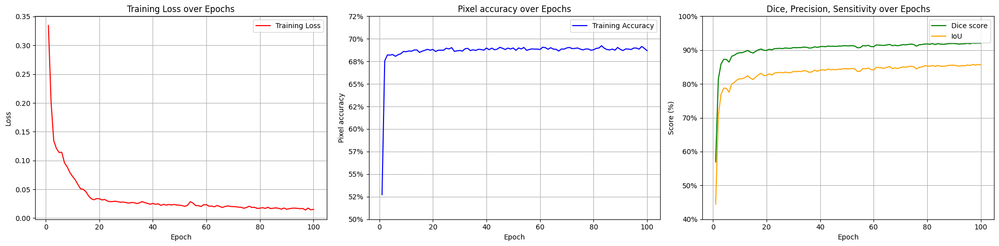

# ***Lite U-Net 3+***
Lightweight variant to U-Net3+, inspired by U-Lite for semantic segmentation

## **Overview**
This network is coded based off the original U-Net3+ in *UNET 3+: A FULL-SCALE CONNECTED UNET
FOR MEDICAL IMAGE SEGMENTATION* by Huimin Huang, Lanfen Lin, and others. The U-Net3+ model was designed to fix the problems occur in U-Net and U-Net++ which is insufficient learning at full-scale and failing to learn boundary and positional information of target (i.e., organ).

Lite U-Net3+ is inspired by the Axial Convolution module in U-Lite model. It is also implmented with ResCBAM, SE and Deep supervision. The Classification guided module, however, is not used because it does not complment with the DSB 2018 dataset, where almost all images are positive(all have cell in them).

## **Model details**

**Features**
1. **Deep supervision** for decoder heads
2. **Squeeze-and-Excitation (SE)** blocks for skips
3. **ResBlock + CBAM** module at BottleNeck
4. **Composite loss**: Focal + Focal-Tversky + Boundary (with weights)
5. **Full-scale Skip Connection** that takes all scale skips
5. **Evaluation**: Global Dice (F1) and IoU

**Dataset**
- Dataset used is [**Data Science Bowl 2018 Nuclei dataset**](https://www.kaggle.com/datasets/sinjoysaha/nucleiimagesmasksfromdsb2018). This dataset is different from the original since the masks of different nulcei have been merged for each image and the new dataset for the sake of convenience. 

**Augmentation**
- Random Cropping
- Random horizontal flip
- Random vertical flip
- Random rotation
- Normalization of mean = [0.485, 0.456, 0.406], std = [0.229, 0.224, 0.225]

## **Training**
**Setup**
- Python: **3.11**
- PyTorch: **2.5.1+cu121**
- GPU: **RTX 4070 Super**

**Hyperparameters**
- Epochs: **100**
- Learning rate: **0.001**
- Scheduler: **ReduceLROnPlateau** (reduce LR by scaling 0.8 on validation plateau)

**Result** of ***Semantic Segmentation***
- Dice score = 92.0 $\pm$ 0.1\%
- IoU score = 85.6 $\pm$ 0.1\%
- Parameters = 1,027,403
- GFLOPS = 2.10 
=> Perform better than Lite U-Net++ on this dataset (check [GitHub's repo](https://github.com/cminh810/Lite-Nested-UNet))

**Plotting training results**

    
  <em> Plots of metrics and loss </em>

**Visualization of segmented outputs**

    
  <em> Segmented predictions </em>

## **References**
- U-Net3+ model: https://arxiv.org/abs/2004.08790
- U-Lite model: https://arxiv.org/pdf/2306.16103
- Boundary loss: https://arxiv.org/abs/1812.07032
- Focal Tversky loss: https://arxiv.org/abs/1810.07842
- Focal loss: https://arxiv.org/abs/1708.02002
- CBAM module: https://arxiv.org/abs/1807.06521

